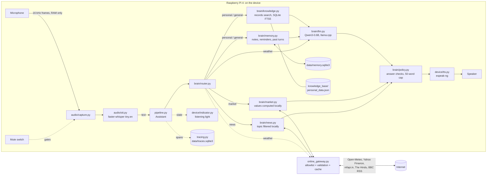

# Offline AI Companion

A private, always-available voice assistant that runs **entirely on a Raspberry Pi 4**.
Speech recognition, reasoning, and speech output all happen on the device. The only
network traffic the design allows is a narrow, allowlisted channel for real-time
facts (weather, news, search), and the reasoning about those facts still happens locally.

Built for Makeathon problem statement 4: *Personal, Offline, Always-On AI Companion*.

```
 Microphone ─► Whisper STT ─► Router ─┬─► Records + memory ─► Qwen3-0.6B (llama.cpp) ─► Answer checks ─► Voice
   (RAM only)    (on device)          │                              ▲                   (≤ 50 words)
                                      └─► Online gateway ────────────┘  (weather, market, news: public identifiers only)
```

---

## Contents

- [Why this exists](#why-this-exists)
- [Status against the challenge requirements](#status-against-the-challenge-requirements)
- [Hardware](#hardware)
- [Quick start](#quick-start)
- [Using the assistant](#using-the-assistant)
- [Architecture](#architecture)
- [Project layout](#project-layout)
- [Privacy guarantees](#privacy-guarantees)
- [Documentation](#documentation)
- [Roadmap](#roadmap)

---

## Why this exists

Cloud-dependent AI wearables stop working when their backend changes or shuts down,
and always-listening devices raise real privacy concerns. This companion takes the
opposite approach: the models live on the device, raw audio never leaves it, and it
keeps working with the network cable unplugged.

## Status against the challenge requirements

| Requirement | Status | Where |
|---|---|---|
| All reasoning on-device, no cloud LLM | ✅ Done | Qwen3-0.6B Q4 via llama.cpp: `brain/llm.py` |
| Raw audio never leaves the device | ✅ Done | Audio held in RAM only; the gateway accepts text only, and a test fails if any other module imports a network library |
| Online calls limited to factual lookups | ✅ Done | Weather (Open-Meteo), **share market** (Yahoo Finance prices, AMFI fund NAVs) and **news** (The Hindu, BBC RSS). Only public identifiers leave the device (a place, ticker symbols, fund codes, a feed address); holdings, topics and questions stay local, and all arithmetic is done on the device. Each feature can be switched off |
| Honest fallback instead of guessing | 🟡 Basic | `brain/policy.py`; signal-based fallback is planned |
| Working demo in a human-potential domain | ✅ Memory & recall | Personal records (`knowledge_base/`), notes ("remember that I parked on B2"), past conversations ("what did you tell me about my EMI?") and follow-ups ("and my wife's?"), all stored on the device. Hybrid search (keywords + a 23 MB embedding model) finds paraphrases ("power tool", "travel documents"); answers found only by meaning are hedged |
| Continuous sensing with **wake word** | ⏳ Removed | Every utterance is treated as a request; a wake-word engine is to be added (e.g. Vosk keyword spotting) |
| **Physical mute switch** | ⏳ Next | Interface and software switch done; GPIO driver planned |
| **Visible listening light** | ⏳ Next | All states implemented, printed to the console; LED driver planned |

## Hardware

| Part | Recommended | Notes |
|---|---|---|
| Board | Raspberry Pi 4 Model B, **4 GB** | 64-bit Raspberry Pi OS **Lite** recommended (the desktop uses several hundred MB of RAM) |
| Storage | 32 GB microSD (A1/A2) | Models and dependencies use about 2 GB |
| Memory use | about 1.1 GB at peak | Qwen3 weights ~370 MB, KV cache 224 MB, compute 150 MB, Whisper tiny.en ~225 MB, leaving over 2 GB free on a 4 GB Pi |
| Cooling | Heatsink + fan case | The Pi 4 throttles at about 80 °C under sustained inference |
| Microphone | ReSpeaker 2-Mic Pi HAT, or any USB mic | The HAT also provides RGB LEDs and a button |
| Speaker | 3.5 mm or USB speaker | For spoken replies |
| Power | Official 5 V / 3 A USB-C supply | Under-voltage causes throttling |

Development also works on macOS or Linux laptops; the same code detects the platform
and adjusts its defaults.

## Quick start

```bash
git clone <this repo> && cd makeathon21_new
scripts/setup.sh                 # one-time install; nothing is compiled on the Pi
scripts/run.sh --text            # type to it first, to check the language model
scripts/run.sh                   # talk to it (the microphone is picked automatically)
```

`setup.sh` installs system packages, creates `.venv`, installs Python dependencies,
downloads and checksum-verifies the Qwen3 model, caches the Whisper model, and runs
the tests. For each step explained, manual installation, and troubleshooting, see
**[docs/setup.md](docs/setup.md)**.

## Using the assistant

| Command | What it does |
|---|---|
| `scripts/run.sh` | Voice mode: microphone → Whisper → local LLM → spoken reply |
| `scripts/run.sh --text` | Type requests; ideal over SSH or without a microphone |
| `scripts/run.sh --no-tts` | Voice in, printed replies out |
| `scripts/run.sh --offline` | Disable every online lookup |
| `scripts/run.sh --list-mics` | List audio devices and their indexes |
| `.venv/bin/python scripts/traces.py serve` | Trace dashboard on http://127.0.0.1:8765 (also `list`, `show last`, `stats`); see [observability](docs/observability.md) |
| `scripts/run.sh --mic-test` | Record 5 seconds to `audio/test.wav` |
| `scripts/run.sh --list-speakers` | List audio outputs (Pi 4 aux jack: `plughw:CARD=Headphones`) |
| `scripts/run.sh --speaker-test` | Speak a test phrase through the selected speaker |

On start-up the assistant introduces itself: *"Hello John, I'm Sam, your private assistant.
Ask me anything."*

Try asking:

- "What is my monthly income?" (answered locally from `knowledge_base/personal_data.json`)
- "What's the weather in Bengaluru?" (only "Bengaluru" and "today" go online; the console shows `[ONLINE]` and `[LOCAL]` steps)
- then a follow-up: "And tomorrow?"
- "Remember that I parked on level B2" … later, even after a restart: "Where did I park?"
- "Remind me to call mom at 6 pm" / "I have a meeting with Jay tomorrow at 7am" → "yes"; then "What's my schedule tomorrow?"
- "What is my monthly income?" then "And my wife's?"; later "What did you tell me about my wife's income?"
- "Forget that" / "Forget everything"
- "How are my investments doing today?" (only `INFY.NS`, `^NSEI`, `^BSESN` and fund code `120377` go online; values and gains are computed on the device)
- "What's the Nifty at?" / "What is the TCS share price?"
- "Latest business news" / "Any news about TCS?" (whole feeds are downloaded; "TCS" is matched on the device)
- "Exit" (stops the session)

The `[LED] ...` lines in the console show the indicator state: `IDLE`, `LISTENING`,
`THINKING`, `ONLINE`, `SPEAKING`, `MUTED`. The physical LED driver will show the
same states.

All settings are environment variables (model path, Whisper size, thresholds, and so on).
See **[docs/configuration.md](docs/configuration.md)**.

## Architecture

Everything inside the box below runs on the Pi. The online gateway is the only part that
touches the network, and it only sends public identifiers (a place name, ticker symbols,
fund codes, a feed address), never the question, the user's records, or audio.



### How a request is handled

`Assistant.respond` in [`pipeline.py`](src/companion/pipeline.py) tries these steps in order
and stops at the first one that applies. Steps 1–4, 6–7 and 9 never call the language model.

| # | Step | Example | Answered by |
|---|---|---|---|
| 1 | Pending confirmation | "yes" after "Do you want me to remember…?" | `memory.py` |
| 2 | Memory command | "Remember that I parked on B2", "Remind me at 6", "Forget that" | `memory.py` |
| 3 | Schedule question | "What's my schedule tomorrow?" | `memory.py`, `schedule.py` |
| 4 | Statement worth noting | "I have a meeting with Jay tomorrow at 7am" → offers to remember it | `memory.py` |
| 5 | Follow-up | "And my wife's?", "when does **it** end?", "is **that** healthy?" or a short "who is the insurer?" within 10 minutes is joined to the previous question, and stored joined, so a third question still knows the topic. A follow-up that names its own recorded topic ("what about my EMI?") is answered by itself | `pipeline.py`, `memory.py` |
| 6 | News | "Any news about TCS?" Whole feeds are fetched; the topic is matched on the device | `news.py` → gateway |
| 7 | Share market | "How are my investments doing today?" Prices are fetched for the whole watchlist; values and gains are computed in Python | `market.py` → gateway |
| 8 | Weather | "Will it rain in Mumbai tomorrow?" Facts are read out verbatim; the model adds one line of advice | gateway → `llm.py` |
| 9 | Loan check | "Can I take a loan of 5 lakhs?" The budget and the EMI are computed from the records, and the answer is built in code | `knowledge.py` |
| 10 | Local answer | "What is my EMI amount?", "Should I invest more?", "Explain mutual funds" | `knowledge.py` + `memory.py` → `llm.py` |

For a local answer (step 10):

1. **Retrieve records.** `KnowledgeBase.search` finds the records that *alone* cover every
   meaningful word of the question, after dropping filler words and adding synonyms
   ("EMI" → installment, loan; "career" → organization, role). It returns at most 4 records,
   and only the primary user's unless someone else is named ("my wife's income").
   Advice questions ("can I…", "should I…", "afford", "eligible") also get every record of
   the category they are about (financial or medical, up to 8 in all), and money
   questions a monthly budget computed in code, placed first.
2. **Retrieve memory.** `ConversationMemory.search` finds notes by keywords plus a small
   embedding model, and past answers only for recall questions ("what did you tell me…").
3. **Answer without the model when possible.** If a note is the only match, it is quoted
   directly. If the question is personal and nothing matches, the reply is
   *"No matched data found."* rather than a guess.
4. **Ask the model.** Only the matching records, notes and the previous exchange go into
   the prompt, labelled with whose record each one is.
5. **Check the answer** before it is spoken (see below).

### Components

| Layer | Modules | Role |
|---|---|---|
| Entry and wiring | `main.py`, `app.py`, `config.py` | Reads environment settings (with Raspberry Pi defaults), builds every component once, warms up the models |
| Turn loop | `pipeline.py` | `MicInput` / `TextInput` produce requests; `Assistant` routes, answers and speaks them, and survives errors in a single turn |
| Audio | `audio/capture.py`, `audio/stt.py` | Records one utterance in RAM, then transcribes it with faster-whisper |
| Reasoning | `brain/router.py`, `brain/llm.py`, `brain/prompts.py`, `brain/policy.py` | Picks the route, runs the local model, builds prompts, checks answers |
| Knowledge and memory | `brain/knowledge.py`, `brain/memory.py`, `brain/schedule.py`, `brain/embeddings.py` | Searches personal records; stores notes, reminders and past turns; parses dates; embeds text for search by meaning |
| Online facts | `online_gateway.py`, `brain/market.py`, `brain/news.py` | The only network exit, plus the on-device logic that decides what to fetch and computes on the results |
| Device | `device/indicator.py`, `device/mute.py`, `device/tts.py` | Listening light, mute switch, speech output. Hardware drivers plug in behind these small interfaces |
| Observability | `telemetry.py`, `tracing.py`, `scripts/traces.py` | Timings and per-turn traces on the device; never prompts, record contents or audio |

### Where data lives

| Data | Location | Lifetime |
|---|---|---|
| Personal records | `knowledge_base/personal_data.json`, indexed in memory at start-up | Edited by hand |
| Company and index names for market lookups | `knowledge_base/market_symbols.json` | Edited by hand |
| Notes, reminders, past questions and answers | `data/memory.sqlite3` (git-ignored) | Past turns 30 days; notes until "forget that" or "forget everything" |
| Conversation traces | `data/traces.sqlite3` | 30 days; erased by "forget everything" |
| Timing log | `logs/assistant.log` | Events and durations only |
| Models | `models/llm/`, `models/embedding/`, Whisper cache | Loaded from local files only |
| Audio | RAM only | Discarded after transcription |

### Answer checks

A 0.6B model is fast enough for a Pi but makes predictable mistakes, so its output is
checked in code rather than by adding more prompt rules (longer prompts made its
answers worse):

| Check | What it prevents |
|---|---|
| Copied example figure | The prompt's example salary ("INR 50,000") being presented as real data |
| False promise | "I'll remember that." Only the app can save notes, so the user is asked instead |
| Uncertain answers | "Not recorded…" is spoken but never stored as a fact |
| Speaking as the user | "I am 175 cm tall" → "You are 175 cm tall"; "my" → "your" |
| Length | At most `MAX_REPLY_WORDS` (50) words, cut at the last full sentence, with generation capped at `LLM_MAX_TOKENS` (80) |

For the full design (the indicator's state machine, retrieval stages, memory search,
the online/offline rules and how each is tested, Pi performance decisions, and extension
points), see **[docs/architecture.md](docs/architecture.md)**.

## Project layout

```
README.md                         this file
docs/
  setup.md                        detailed installation, Pi notes, troubleshooting
  configuration.md                every environment variable
  architecture.md                 pipeline, modules, privacy boundary, extension points
  observability.md                conversation traces: what is recorded, CLI, dashboard
  benchmarks.md                   how the models were chosen; how to re-run the benchmarks
scripts/
  setup.sh                        one-time setup (Pi OS / Debian / macOS)
  run.sh                          start the assistant with model hubs forced offline
  mic_test.py                     record a test clip
  traces.py                       view conversation traces: list, show, stats, serve (dashboard)
  eval_llm.py, eval_assistant.py, eval_memory_retrieval.py   benchmarks with the real models
src/
  main.py                         entry point
  companion/
    app.py                        builds components from configuration
    config.py                     settings with Raspberry Pi 4 defaults
    pipeline.py                   turn loop, microphone and text input
    online_gateway.py             the ONLY module allowed network access
    telemetry.py                  JSON timing logs (no prompts or audio)
    tracing.py                    per-turn traces stored on the device
    audio/   capture.py, stt.py
    brain/   llm.py, router.py, prompts.py, policy.py, knowledge.py, memory.py,
             schedule.py, embeddings.py, market.py, news.py
    device/  indicator.py, mute.py, tts.py
knowledge_base/personal_data.json synthetic personal records used in the demo
knowledge_base/market_symbols.json company and index names mapped to ticker symbols
models/                           local model files (LLM, embeddings); not in git
data/                             memory and trace databases; not in git
tests/                            unit tests (run without models or audio hardware)
tests/data/                       retrieval and conversation benchmarks
```

## Privacy guarantees

1. **Reasoning is local.** Every answer comes from the on-device model.
2. **Audio stays in memory.** Recordings are never written to disk or sent anywhere,
   and audio captured while the mute switch is flipped is discarded.
3. **One network exit.** Only `online_gateway.py` may import networking code. It accepts
   plain text only, refuses requests mentioning private data (financial, medical,
   documents, recordings), and only contacts allowlisted hosts.
4. **Models are offline at runtime.** Every model loads from local files only (Whisper with
   `local_files_only=True`, the others from `models/`), however the app is started; `run.sh`
   additionally sets `HF_HUB_OFFLINE=1`. A traced session made no connections except the
   two Open-Meteo calls for a weather question.
5. **Memory stays on the device and can be erased.** Notes and past questions and answers
   are kept as text in `data/memory.sqlite3` (git-ignored); past exchanges are deleted after
   30 days, notes and reminders when the user asks; everything can be
   erased on request ("forget that", "forget everything"). Audio and ignored speech are
   never stored; `MEMORY=0` keeps memory for the current session only.
6. **Logs hold timings, not content.** `logs/assistant.log` records events and durations,
   never prompts, transcripts, or audio. Conversation traces (`data/traces.sqlite3`) add
   routes, step timings and token counts, plus the question and reply text unless
   `TRACE_CONTENT=0`; never record contents, prompts or audio. They stay on the device,
   expire after 30 days and are erased by "forget everything".

Points 2 and 3 are enforced by tests in `tests/test_privacy_and_control.py`.

## Documentation

| Document | Read it when you want to |
|---|---|
| [docs/setup.md](docs/setup.md) | Install on a Pi or laptop, step by step, and fix problems |
| [docs/configuration.md](docs/configuration.md) | Tune models, microphone sensitivity, or performance |
| [docs/architecture.md](docs/architecture.md) | Understand the pipeline or add a feature |
| [docs/observability.md](docs/observability.md) | See why a reply was slow or how it was answered: per-turn traces, CLI and dashboard |
| [docs/benchmarks.md](docs/benchmarks.md) | See how the language and memory models were chosen, and re-run the benchmarks on the Pi |

## Roadmap

1. **Must-haves:** GPIO mute switch and LED driver (interfaces ready; waiting on hardware choice).
2. **Core use case:** spoken reminders ("remind me at 6"), grammar-constrained intent routing.
3. **Polish:** signal-based honest fallback, Piper TTS, local web dashboard showing LOCAL vs ONLINE steps, systemd service.

## Running the tests

```bash
.venv/bin/python -m unittest discover -s tests
```

The tests use fakes, so they need no models, microphone, or network.
