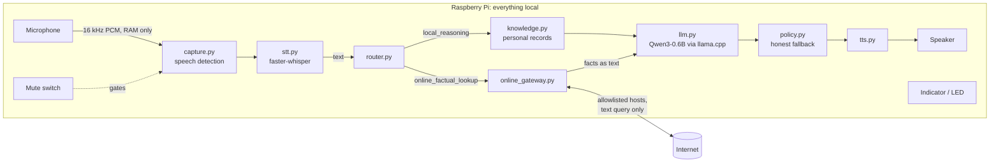
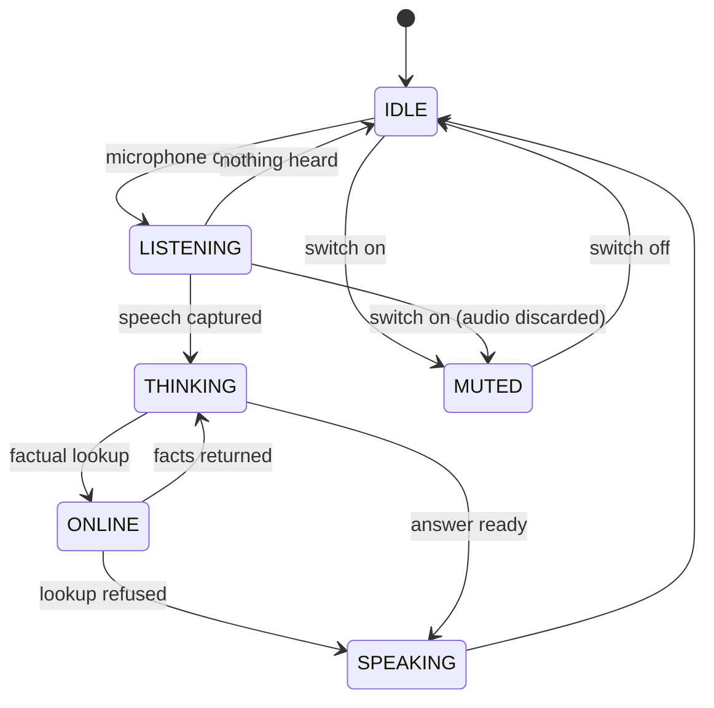

# Architecture

This document explains how a request flows through the companion, what each module
is responsible for, how the privacy boundary is enforced, and where to plug in new
hardware or features.

## Design principles

1. **Local first.** Every model (speech recognition, language model, speech output) runs on
   the device. The network is an optional add-on for real-time facts, never a dependency.
2. **One network exit.** A single module may talk to the internet, and it only accepts text.
3. **Small interfaces.** Hardware (LED, mute switch, speaker, microphone) and models sit
   behind tiny interfaces, so a Pi driver or a different model replaces one class, not
   the pipeline.
4. **Built for a Pi 4.** Each model is loaded once; work runs one stage at a time so stages
   never compete for the four cores; heavy libraries are imported only when used.

## Request flow



The indicator is updated at each stage:



### One turn, step by step

1. **Mute check.** `MicInput` asks the `MuteSwitch`. If muted, the indicator shows
   `MUTED` and the microphone is never opened.
2. **Capture.** `MicrophoneCapture.record_utterance` reads 100 ms blocks and starts
   keeping audio once loudness passes `SPEECH_RMS_THRESHOLD`. It stops after
   `SILENCE_SECONDS` of quiet or `MAX_RECORD_SECONDS`. If the mute switch flips
   mid-recording, the audio is discarded.
3. **Transcribe.** `Transcriber` runs faster-whisper (int8, CPU) on the in-memory
   waveform. Its built-in voice-activity filter trims silence.
4. **Route.** `router.route` returns `EXIT`, `ONLINE_LOOKUP` (weather, forecast, news,
   search, current events, provided the request doesn't mention private data), or
   `LOCAL_REASONING`.
5. **Look up (optional).** `OnlineGateway.lookup` validates the query and calls a
   provider. If it cannot, the assistant says so and stops; it never lets the model
   guess real-time facts.
6. **Reason locally.** `find_relevant_records` selects matching personal records as
   readable text; `LocalLLM.chat` answers with the system prompt, question, records,
   and any online facts.
7. **Check.** `require_local_answer` replaces empty or uncertain answers with an honest
   fallback message.
8. **Speak.** The `Speaker` says the reply; the indicator returns to `IDLE`.

Any exception during steps 4–7 is logged, the user hears an apology, and the loop
continues, so an always-on device does not die on one bad request.

## Modules

| Module | Responsibility | Key types |
|---|---|---|
| `main.py` | Entry point; handles Ctrl+C | |
| `companion/app.py` | Composition root: reads config, builds and wires components, chooses mic or text input | `main()` |
| `companion/config.py` | Environment settings; Raspberry Pi detection and Pi defaults | `AppConfig`, `LLMConfig`, `STTConfig`, `CaptureConfig` |
| `companion/pipeline.py` | The turn loop and input sources | `Assistant`, `MicInput`, `TextInput` |
| `companion/audio/capture.py` | Microphone selection and utterance recording | `MicrophoneCapture`, `choose_input_device` |
| `companion/audio/stt.py` | Speech-to-text | `Transcriber` |
| `companion/brain/llm.py` | Loads the GGUF model once; chat completion; strips `<think>` traces and repeats | `LocalLLM`, `clean_model_response` |
| `companion/brain/router.py` | Intent decision | `Intent`, `route` |
| `companion/brain/prompts.py` | System prompt and prompt assembly | `SYSTEM_PROMPT`, `build_user_prompt` |
| `companion/brain/policy.py` | What may go online; when to fall back | `is_allowed_cloud_lookup`, `require_local_answer` |
| `companion/brain/knowledge.py` | Loads and searches personal records | `load_knowledge`, `find_relevant_records` |
| `companion/device/indicator.py` | Listening-light states | `IndicatorState`, `Indicator`, `ConsoleIndicator` |
| `companion/device/mute.py` | Mute switch | `MuteSwitch`, `SoftwareMuteSwitch` |
| `companion/device/tts.py` | Spoken output | `Speaker`, `Pyttsx3Speaker`, `PrintSpeaker` |
| `companion/online_gateway.py` | The only network exit | `OnlineGateway`, `LookupResult`, `LookupUnavailable` |
| `companion/telemetry.py` | JSON timing log without content | `log_event`, `timed_event` |

## The online/offline boundary

| Rule | How it is enforced |
|---|---|
| Only the gateway may use the network | `test_only_gateway_imports_network_libraries` parses every module and fails if any other file imports `socket`, `urllib.request`, `http.client`, `requests`, `httpx`, `urllib3`, or `aiohttp` |
| Audio can never be sent | `OnlineGateway.lookup` raises `TypeError` for anything that is not `str` (tested with bytes and NumPy arrays) |
| Only factual lookups go out | The gateway re-checks `is_allowed_cloud_lookup`, refusing requests that mention financial, medical, document, recording, personal, or private data |
| Only known hosts are contacted | `check_host_allowed` validates each URL against `ALLOWED_HOSTS` |
| Users can switch it off | `--offline` or `ONLINE_LOOKUPS=0` |
| Models never phone home | `run.sh` sets `HF_HUB_OFFLINE=1` |
| Online moments are visible | The indicator shows `ONLINE` only while the gateway is in use |

## Pi 4 performance decisions

| Decision | Reason |
|---|---|
| Qwen3-0.6B at Q4_K_M (~400 MB) | Whole pipeline peaks at about 1.1 GB, leaving over 2 GB free on a 4 GB Pi |
| Prebuilt baseline-ARMv8 llama.cpp wheel | No 20–40 minute compile on the Pi, and no `dotprod`/`i8mm`/SVE instructions that the Cortex-A72 lacks (verified by disassembly) |
| `/no_think` + ChatML | Qwen3 otherwise writes a hidden reasoning trace first, costing seconds per reply |
| `LLM_MAX_TOKENS=128` | Caps worst-case reply generation time |
| Whisper `tiny.en`, greedy decoding on Pi | Several times faster than `base` with beam 5; English-only models are more accurate for English |
| 16 kHz native capture | Avoids resampling (and importing scipy) when the mic supports it |
| Models loaded once at startup | Loading takes seconds; per-request loading would dominate latency |
| Stages run sequentially | STT and LLM each get all four cores instead of competing |
| Lazy imports | Text mode and tests run without audio libraries; startup loads only what is used |

## Extension points

Each extension is one new class satisfying a small interface, wired in `app.py`.

### LED driver

```python
class GpioLedIndicator:
    def show(self, state: IndicatorState) -> None:
        ...  # set LED colour for MUTED / IDLE / LISTENING / THINKING / ONLINE / SPEAKING
```

### Physical mute switch

```python
class GpioMuteSwitch:
    def is_muted(self) -> bool:
        ...  # read the switch's GPIO pin
```

### Online provider

Add the host to `ALLOWED_HOSTS` in `online_gateway.py`, call `check_host_allowed(url)`
before each request, and return a `LookupResult(source=..., text=...)` from `lookup`.
Keep all networking code inside this file.

### New input source (e.g. wake word)

Anything with `next_utterance() -> str | None` can drive `Assistant.run`: return text
for a request, `""` when nothing was heard, and `None` to stop.

### Different language model

Anything with `chat(system: str, user: str) -> str` can replace `LocalLLM`; for GGUF
models, only configuration changes are needed (see [configuration.md](configuration.md)).

## Known limitations

| Limitation | Planned fix |
|---|---|
| No wake word; any speech above the threshold is treated as a request | openWakeWord as an input stage before capture |
| Mute switch and LED are software/console only | GPIO drivers (interfaces are ready) |
| Online gateway has no providers, so lookups are refused | Open-Meteo weather first |
| Keyword retrieval misses plurals and synonyms ("loans" vs "loan") | SQLite FTS5 with stemming |
| Fallback check flags any answer containing "can't" | Fall back on signals (empty retrieval, out-of-scope intent) instead of keywords |
| Router is keyword-based | Grammar-constrained LLM intent output |
| pyttsx3/espeak voice is robotic | Piper TTS |

## Testing

`tests/test_privacy_and_control.py` covers the privacy boundary, routing, fallback,
response cleaning, knowledge formatting, mute and indicator behaviour, and the turn
loop (including error recovery). Models, audio, and network are replaced by fakes,
so the suite runs in well under a second anywhere:

```bash
.venv/bin/python -m unittest discover -s tests
```
