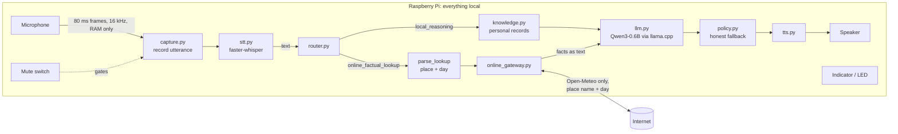
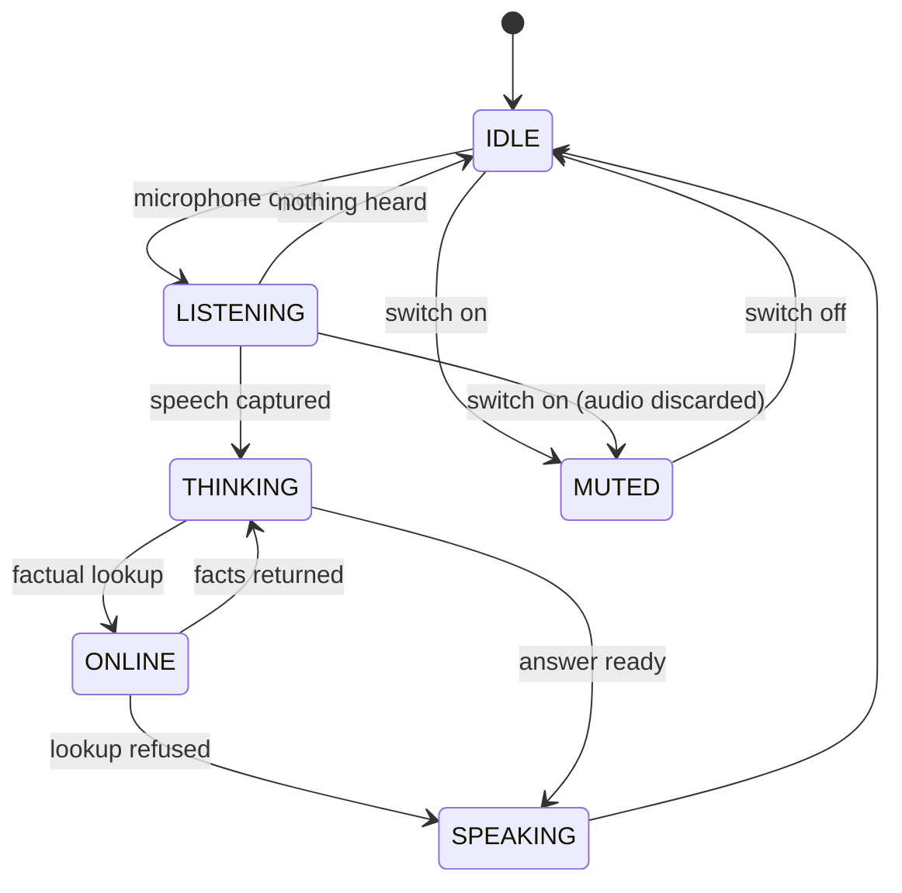

# Architecture

This document explains how a request flows through the companion, what each module
is responsible for, how the privacy boundary is enforced, and where to plug in new
hardware or features.

## Design principles

1. **Local first.** Every model (speech recognition, language model, speech output) runs on
   the device. The network is an optional add-on for real-time facts, never a dependency.
2. **One network exit.** A single module may talk to the internet, and it only accepts text.
3. **Small interfaces.** Hardware (LED, mute switch, speaker, microphone) and models sit
   behind tiny interfaces, so a Pi driver or a different model replaces one class, not
   the pipeline.
4. **Built for a Pi 4.** Each model is loaded once; work runs one stage at a time so stages
   never compete for the four cores; heavy libraries are imported only when used.

## Request flow



The indicator is updated at each stage:



### One turn, step by step

1. **Mute check.** `MicInput` asks the `MuteSwitch`. If muted, the indicator shows
   `MUTED` and the microphone is never opened.
2. **Capture.** Only the last 0.5 s before speech starts is kept, and speech must last
   `SPEECH_ONSET_FRAMES` (3) frames to count, so earlier room noise never reaches Whisper (on the
   Pi it had made transcription take 8–16 s). `MicrophoneCapture.frames` streams 80 ms frames of 16 kHz audio
   (resampled if the mic can't do 16 kHz). `record_command` keeps audio once loudness
   passes `SPEECH_RMS_THRESHOLD` and stops after `SILENCE_SECONDS` of quiet. If the
   mute switch flips, the stream stops and the audio is discarded.
3. **Transcribe.** `Transcriber` runs faster-whisper (int8, CPU) on the in-memory
   waveform. Its built-in voice-activity filter trims silence.
4. **Route.** `router.route` returns `EXIT`, `ONLINE_LOOKUP` (weather, forecast, news,
   search, current events, provided the request doesn't mention private data), or
   `LOCAL_REASONING`.
5. **Look up (optional).** `OnlineGateway.lookup` validates the query and calls a
   provider. If it cannot, the assistant says so and stops; it never lets the model
   guess real-time facts.
6. **Retrieve.** Memory commands ("remember that…", "remind me…", "forget that"), the
   answer to a pending "what should I remember?" / "do you want me to remember…?", and
   schedule questions ("what's my schedule tomorrow?") are handled first, without the model. A follow-up ("and my wife's?") is combined with the previous
   question. `KnowledgeBase.search` finds personal records and `ConversationMemory.search`
   finds notes and, for recall questions, past exchanges (details below). An answer
   that comes only from a note is given directly from it. If the question is personal
   and nothing matches anywhere, the assistant answers "I couldn't find that in your
   personal records" without calling the model.
7. **Reason locally.** `LocalLLM.chat` answers from the system prompt, question,
   owner-labelled records, and any online facts.
8. **Check.** `require_local_answer` replaces an empty answer with an honest
   fallback message. Uncertain answers ("not recorded…") are spoken in the model's own
   words but not remembered as facts.
9. **Speak.** The `Speaker` says the reply; the indicator returns to `IDLE`.

Any exception during steps 4–8 is logged, the user hears an apology, and the loop
continues, so an always-on device does not die on one bad request.

## Modules

| Module | Responsibility | Key types |
|---|---|---|
| `main.py` | Entry point; handles Ctrl+C | |
| `companion/app.py` | Composition root: reads config, builds and wires components, chooses mic or text input | `main()` |
| `companion/config.py` | Environment settings; Raspberry Pi detection and Pi defaults | `AppConfig`, `LLMConfig`, `STTConfig`, `CaptureConfig` |
| `companion/pipeline.py` | The turn loop and input sources | `Assistant`, `MicInput`, `TextInput` |
| `companion/audio/capture.py` | Microphone selection and utterance recording | `MicrophoneCapture`, `choose_input_device` |
| `companion/audio/stt.py` | Speech-to-text | `Transcriber` |
| `companion/brain/llm.py` | Loads the GGUF model once; chat completion; strips `<think>` traces and repeats | `LocalLLM`, `clean_model_response` |
| `companion/brain/router.py` | Intent decision | `Intent`, `route` |
| `companion/brain/prompts.py` | System prompt and prompt assembly | `SYSTEM_PROMPT`, `build_user_prompt` |
| `companion/brain/policy.py` | What may go online; when to fall back | `is_allowed_cloud_lookup`, `require_local_answer` |
| `companion/brain/knowledge.py` | Loads personal records and searches them (FTS5, owners, record-type focus) | `load_knowledge`, `KnowledgeBase`, `Match` |
| `companion/brain/memory.py` | Notes, past exchanges, follow-ups, forgetting; SQLite on the device | `ConversationMemory`, `parse_memory_command`, `MemoryItem` |
| `companion/device/indicator.py` | Listening-light states | `IndicatorState`, `Indicator`, `ConsoleIndicator` |
| `companion/device/mute.py` | Mute switch | `MuteSwitch`, `SoftwareMuteSwitch` |
| `companion/device/tts.py` | Spoken output: espeak-ng + aplay on Linux (no sound server needed), pyttsx3 elsewhere | `Speaker`, `EspeakSpeaker`, `Pyttsx3Speaker`, `PrintSpeaker`, `make_speaker` |
| `companion/online_gateway.py` | The only network exit: weather, market, news; validation, allowlist, cache, per-feature switches | `OnlineGateway`, `LookupRequest`, `LookupResult`, `LookupUnavailable` |
| `companion/brain/market.py` | Portfolio: which symbols to fetch, all values and gains computed locally | `Portfolio`, `Holding` |
| `companion/brain/news.py` | Which feeds to fetch; topic filtering on the device | `news_request`, `headlines_reply` |
| `companion/telemetry.py` | JSON timing log without content; each timed event is also a trace span | `log_event`, `timed_event` |
| `companion/tracing.py` | Per-turn traces (spans, routes, token counts) in `data/traces.sqlite3`; console summary | `Tracer`, `span`, `annotate`, `set_turn` |
| `companion/brain/schedule.py` | Dates and times in spoken notes | `parse_when`, `When` |

## Knowledge retrieval

`KnowledgeBase` indexes `knowledge_base/personal_data.json` once at startup in an
in-memory SQLite FTS5 table (built into Python, no extra RAM-heavy model). For each
question:

| Stage | What it does | Example |
|---|---|---|
| Terms | Drops filler words (incl. everyday verbs, adverbs, pronouns: *taking, daily, now, under…*) and adds synonyms from `SYNONYMS` | "EMI" → emi, installment, loan; "medications" → prescription, dosage |
| Match | Porter-stemmed full-text search, BM25-ranked, over each record's fields (`body`) and its category (`topic`) | "loans" finds "Home Loan"; "my medical records" finds all medical records |
| Owner filter | "my"/"I" means the primary user (most frequent owner, or `PRIMARY_USER`); other people only when named (relation or name); "family" covers everyone; shared "family" records are always included | "my income" never returns the wife's salary |
| Coverage | A record is kept only if **it alone** covers every meaningful question word (the word or a synonym). Named things (companies, banks, models, places, and their acronyms) may be covered by any matching record, so they can point at another record | "when does my passport expire" → nothing (no record has both); "where did I work before Infosys" → the TCS job |
| Category collisions | A word sharing its stem with a category name ("medications" / "medical" → `medic`) is matched through its synonyms only | "my medications" → the prescription, not every medical record |
| Acronyms | Names of three or more capitalised words are also indexed by their initials | "SBI" → State Bank of India bond; "TCS" → Tata Consultancy Services |
| Ranking | Records containing a named thing from the question first, then current before "previous …" records (unless the question says before/previous/earlier), then BM25 | "which insurer covers my Hero Splendor" → that bike; "where do I work" → current job |
| Top-k | Keep at most `KNOWLEDGE_TOP_K` records (default 4) | Short prompts on the Pi |
| Format | One line per record, labelled with category and owner, plus a note mapping synonyms | "Financial record of John's wife: …" |

`tests/data/knowledge_retrieval_eval.json` holds 81 natural spoken questions (including
real phrasings like "what are the medications I am taking daily?"), each with the record
type it must find or `null` if it must find nothing; a unit test requires all of them
except one documented limitation (see docs/benchmarks.md).

The system prompt names the primary user, tells the model to address them as "you",
states the currency (`CURRENCY`, default INR), and includes a one-line example answer,
which a 0.6B model follows more reliably than rules.

## Conversation memory

`ConversationMemory` keeps text (never audio) in an FTS5 table in
`data/memory.sqlite3`, one row per note or exchange, with a timestamp, and one
embedding per row in a `vectors` table of the same file.

**Hybrid search.** A stored item matches if it contains **every** meaningful word of
the question (stemmed, with synonyms; marked `exact`), or if its embedding's cosine
similarity is at least `MEMORY_MIN_SIMILARITY` (0.35). Exact matches rank first, then
by similarity. Embeddings come from all-MiniLM-L6-v2 int8 run on onnxruntime
(`brain/embeddings.py`, no extra packages); similarities are a NumPy dot product over
the stored vectors, which takes well under a millisecond for hundreds of memories, so no
vector database or SQLite extension is needed. Rows stored before embeddings were
enabled are embedded at startup; vectors are deleted with their rows.

**Why hybrid and not embeddings or GraphRAG alone:** measured in
`scripts/eval_memory_retrieval.py` (see configuration.md, *Choosing the embedding
model*), embeddings lift paraphrase recall from 79% to 94%, but no method separates
near-misses ("wife's birthday" vs a note about mom's) because they *are* semantically
similar. Keyword coverage tells the two apart cheaply, so it decides how confident the
answer sounds. GraphRAG would need the 0.6B model to extract entities reliably and
targets cross-document summaries, not lookups; the data's structure (owner → record
type → fields) already gives the graph that matters.

**Honest answers.** A note found only by meaning is answered with a hedge: "I'm not
certain, but the closest thing I remember is: on 9 October you told me that mom's
birthday is on 12 March." The note is quoted, never paraphrased by the model, so a
near-miss is visible rather than invented. In the benchmark, all wrong matches were
hedged.

| Memory | Stored when | Used when |
|---|---|---|
| Note | "Remember (that) …", "Remind me …", or "yes" to "Do you want me to remember …?" | Every question. If a note is the only match, the reply is built from it directly ("On 9 October you told me that you parked on level B2"), so a small model can't misquote it |
| Exchange | A question got a real answer (honest "not in your records" or failed lookups are **not** stored, so they can't come back as facts) | Recall questions only ("did you…", "what did you tell me…", "earlier", "yesterday"), so old answers don't distract ordinary ones. "Yesterday" filters by date |
| Previous exchange | Same | A follow-up starting with "and", "what about", "how about" within `FOLLOW_UP_MINUTES`; it is combined with the previous question for routing and search, and shown to the model. For weather, a newly named place replaces the old one ("what about in Mumbai?") |

**Dates and reminders** (`brain/schedule.py`). A note naming a date or time is stored with
it resolved ("meeting with Jay tomorrow at 7am" → "meeting with Jay on Saturday 10 October
at 7:00 AM"), so it stays true on later days, and gets a row in the `schedule` table (due
time, the note without its date words, announced flag). Schedule questions list that
table's rows for a day; timed rows are announced once when due, between turns.

Notes are kept until the user deletes them. Exchanges older than `MEMORY_RETENTION_DAYS`
are deleted at startup; "forget that" and "forget everything" delete on request.
When a note and a past exchange both match, the note ranks first. Knowledge search also refuses to answer when a
meaningful word of the question appears in none of the matching records ("where is my
car key" is not answered from a car record), so such questions fall through to memory
or to an honest "not found".

## The online/offline boundary

| Rule | How it is enforced |
|---|---|
| Only the gateway may use the network | `test_only_gateway_imports_network_libraries` parses every module and fails if any other file imports `socket`, `urllib.request`, `http.client`, `requests`, `httpx`, `urllib3`, or `aiohttp` |
| Neither audio nor the question can be sent | `OnlineGateway.lookup` accepts only a `LookupRequest(kind, place, day)` built locally by `parse_lookup`, and raises `TypeError` for anything else, including plain strings (tested with text, bytes and NumPy arrays) |
| Only public identifiers go out | Weather: `PLACE_PATTERN` (a short place name, not "my salary is 85000"). Market: `SYMBOL_PATTERN` and `FUND_CODE_PATTERN` (ticker symbols, numeric codes). News: only keys of the built-in `FEEDS`. Anything else is refused before sending |
| Holdings never go out | `Portfolio.request` always sends the whole watchlist (the primary user's holdings plus indices), so the request doesn't reveal which holding was asked about; quantities and prices paid stay local, and values and gains are computed in Python, not by the LLM |
| Topics never go out | News fetches whole feeds; `headlines_reply` keeps headlines containing every topic word |
| Only factual lookups go out | Weather, market and news only; anything else (e.g. "search") is refused |
| Replies show the boundary | "From Yahoo Finance and AMFI, online: … Computed on this device: …"; console `[ONLINE]`/`[LOCAL]` lines; the LED shows `ONLINE` |
| Only known hosts are contacted | `check_host_allowed` validates each URL against `ALLOWED_HOSTS` |
| Users can switch it off | `--offline` or `ONLINE_LOOKUPS=0` for everything; `ONLINE_WEATHER`, `ONLINE_MARKET`, `ONLINE_NEWS` per feature |
| Models never phone home | Whisper loads with `local_files_only=True` (without it, faster-whisper contacts huggingface.co at every start); the LLM and embedding models are plain local files; `run.sh` also sets `HF_HUB_OFFLINE=1` |
| Online moments are visible | The indicator shows `ONLINE` only while the gateway is in use |

## Observability

Each turn is a trace of timed spans (listen, stt, knowledge, memory, online_lookup,
llm_generation, speak) with its route and reply time, stored on the device and shown on the
console, by `scripts/traces.py`, and on a localhost dashboard. Record contents, prompts and
audio are never traced. See [observability.md](observability.md).

## Pi 4 performance decisions

| Decision | Reason |
|---|---|
| Qwen3-0.6B at Q4_K_M (~400 MB) | Whole pipeline peaks at about 1.1 GB, leaving over 2 GB free on a 4 GB Pi |
| Prebuilt baseline-ARMv8 llama.cpp wheel | No 20–40 minute compile on the Pi, and no `dotprod`/`i8mm`/SVE instructions that the Cortex-A72 lacks (verified by disassembly) |
| `/no_think` + ChatML | Qwen3 otherwise writes a hidden reasoning trace first, costing seconds per reply |
| `LLM_MAX_TOKENS=128` | Caps worst-case reply generation time |
| Whisper `tiny.en`, greedy decoding on Pi | Several times faster than `base` with beam 5; English-only models are more accurate for English |
| 16 kHz native capture | Avoids resampling (and importing scipy) when the mic supports it |
| Models loaded once at startup; the system prompt is processed during start-up (`LocalLLM.warm_up`) | Loading takes seconds; llama.cpp then reuses the processed prompt, so the first answer on a Pi 4 takes ~8 s instead of ~23 s |
| Stages run sequentially | STT and LLM each get all four cores instead of competing |
| Lazy imports | Text mode and tests run without audio libraries; startup loads only what is used |
| Memory: FTS5 + int8 MiniLM embeddings, NumPy similarity, top 3 items | ~90 MB RAM and ~1 ms per question for 94% vs 79% paraphrase recall; no vector database; only relevant items reach the prompt |

## Extension points

Each extension is one new class satisfying a small interface, wired in `app.py`.

### LED driver

```python
class GpioLedIndicator:
    def show(self, state: IndicatorState) -> None:
        ...  # set LED colour for MUTED / IDLE / LISTENING / THINKING / ONLINE / SPEAKING
```

### Physical mute switch

```python
class GpioMuteSwitch:
    def is_muted(self) -> bool:
        ...  # read the switch's GPIO pin
```

### Online provider (e.g. currency rates)

In `online_gateway.py`: add the host to `ALLOWED_HOSTS` and the kind to `KINDS`, validate
its fields in `_validate`, implement `_<kind>(request)` using `self._get(...)` (which
enforces the allowlist, caches, reuses stale data when offline, and is replaced by a fake
in tests), and return `LookupResult(source, text, data)`. Add an `ONLINE_<KIND>` switch in
`config.py`. Keep all networking code in this file, send only `LookupRequest` fields, and
do any computation on the result locally.

### New input source

Anything with `next_utterance() -> str | None` can drive `Assistant.run`: return text
for a request, `""` when nothing was heard, and `None` to stop.

### Different language model

Anything with `chat(system: str, user: str) -> str` can replace `LocalLLM`; for GGUF
models, only configuration changes are needed (see [configuration.md](configuration.md)).

## Known limitations

| Limitation | Planned fix |
|---|---|
| Mute switch and LED are software/console only | GPIO drivers (interfaces are ready) |
| Share prices use Yahoo Finance's unofficial, undocumented endpoint, which may change or rate-limit | Provider is swappable in `online_gateway.py`; cached results and an honest "couldn't get live prices" fallback to saved records |
| News is read out as verbatim headlines, not summarised (the 0.6B model could distort them) | A larger model could summarise |
| The 0.6B model's one-line weather advice can misjudge probabilities (e.g. "likely to rain" at 14%) | The facts are always read out verbatim first; a larger model or rule-based advice |
| The 0.6B model sometimes refuses with the right record in context ("what are the medications I am taking daily?" → "not recorded"); Qwen3-1.7B answers it | Larger model on the Pi, if its speed is acceptable (see docs/benchmarks.md) |
| Memory can't reject near-misses ("wife's birthday" vs mom's) | They are answered with a hedge and the note quoted verbatim |
| Some paraphrases fall just below the similarity threshold ("power tool" → drill scores 0.31 with the int8 model) | Lower `MEMORY_MIN_SIMILARITY`, at the cost of more hedged near-misses; or a larger embedding model |
| Router is keyword-based | Grammar-constrained LLM intent output |
| espeak-ng voice is robotic | Piper TTS (same aplay output path) |

## Testing

`tests/test_privacy_and_control.py` covers the privacy boundary, routing, fallback,
response cleaning, knowledge formatting, mute and indicator behaviour, and the turn
loop (including error recovery). Models, audio, and network are replaced by fakes,
so the suite runs in well under a second anywhere:

```bash
.venv/bin/python -m unittest discover -s tests
```
